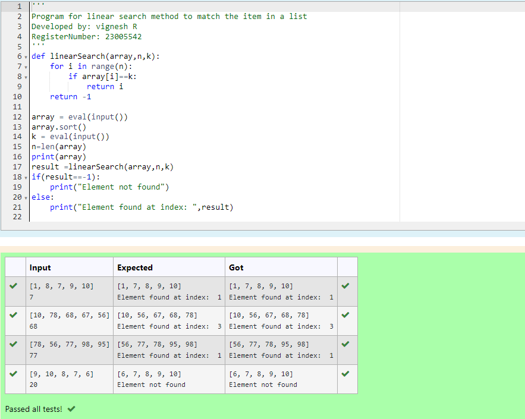
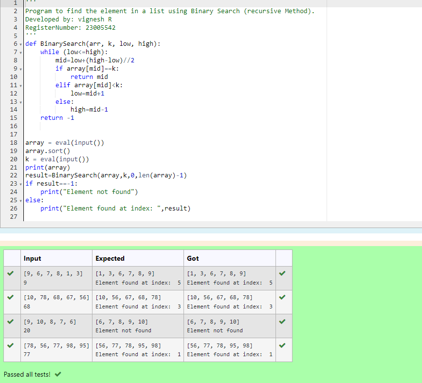
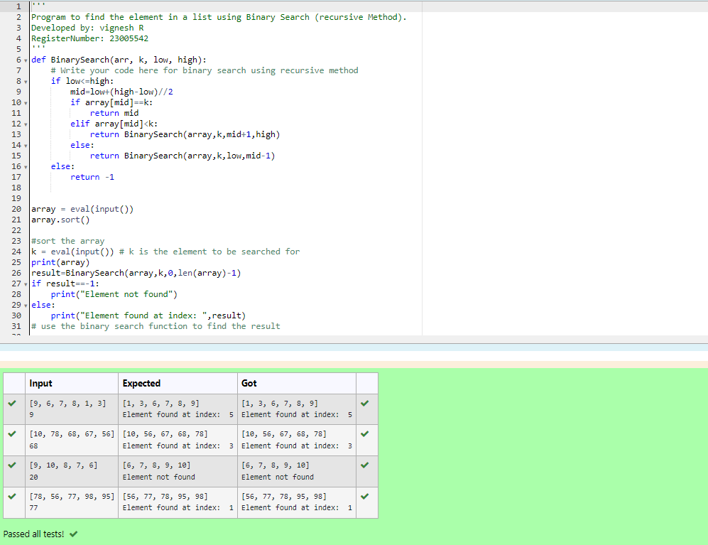

# Linear Search and Binary search
## Aim:
To write a program to perform linear search and binary search using python programming.
## Equipment’s required:
1.	Hardware – PCs
2.	Anaconda – Python 3.7 Installation / Moodle-Code Runner
## Algorithm:
## Linear Search:
1.	Start from the leftmost element of array[ ] and compare k with each element of array[ ] one by one.
2.	If k matches with an element in array[ ] , return the index.
3.	If k doesn’t match with any of elements in array[], return -1 or element not found.
## Binary Search:
1.	Set two pointers low and high at the lowest and the highest positions respectively.
2.	Find the middle element mid of the array ie. arr[(low + high)/2]
3.	If x == mid, then return mid.Else, compare the element to be searched with m.
4.	If x > mid, compare x with the middle element of the elements on the right side of mid. This is done by setting low to low = mid + 1.
5.	Else, compare x with the middle element of the elements on the left side of mid. This is done by setting high to high = mid - 1.
6.	Repeat steps 2 to 5 until low meets high
## Program:
### linear search
```py
''' 
Program for linear search method to match the item in a list
Developed by: vignesh R
RegisterNumber: 23005542
'''
def linearSearch(array,n,k):
    for i in range(n):
        if array[i]==k:
            return i
    return -1
    
array = eval(input())
array.sort()
k = eval(input())
n=len(array)
print(array)
result =linearSearch(array,n,k)
if(result==-1):
    print("Element not found")
else:
    print("Element found at index: ",result)


```
### binary search(Iterative  Method)
``` py
'''
Program to find the element in a list using Binary Search (Iterative  Method).
Developed by: vignesh R
RegisterNumber: 23005542
'''
def BinarySearch(arr, k, low, high):
    while (low<=high):
        mid=low+(high-low)//2
        if array[mid]==k:
            return mid
        elif array[mid]<k:
            low=mid+1
        else:
            high=mid-1
    return -1
        
    
array = eval(input())
array.sort()
k = eval(input()) 
print(array)
result=BinarySearch(array,k,0,len(array)-1)
if result==-1:
    print("Element not found")
else:
    print("Element found at index: ",result)


```
### Binary Search (recursive Method)
```py
''' 
Program to find the element in a list using Binary Search (recursive Method).
Developed by: vignesh R
RegisterNumber: 23005542
'''
def BinarySearch(arr, k, low, high):
    # Write your code here for binary search using recursive method
    if low<=high:
        mid=low+(high-low)//2
        if array[mid]==k:
            return mid
        elif array[mid]<k:
            return BinarySearch(array,k,mid+1,high)
        else:
            return BinarySearch(array,k,low,mid-1)
    else:
        return -1
        
    
array = eval(input())
array.sort()

#sort the array
k = eval(input()) # k is the element to be searched for
print(array)
result=BinarySearch(array,k,0,len(array)-1)
if result==-1:
    print("Element not found")
else:
    print("Element found at index: ",result)

```
## Sample Input and Output
### linear search

### Binary Search(Iterative Method)


### Binary Search (recursive Method)



## Result
Thus the linear search and binary search algorithm is implemented using python programming.